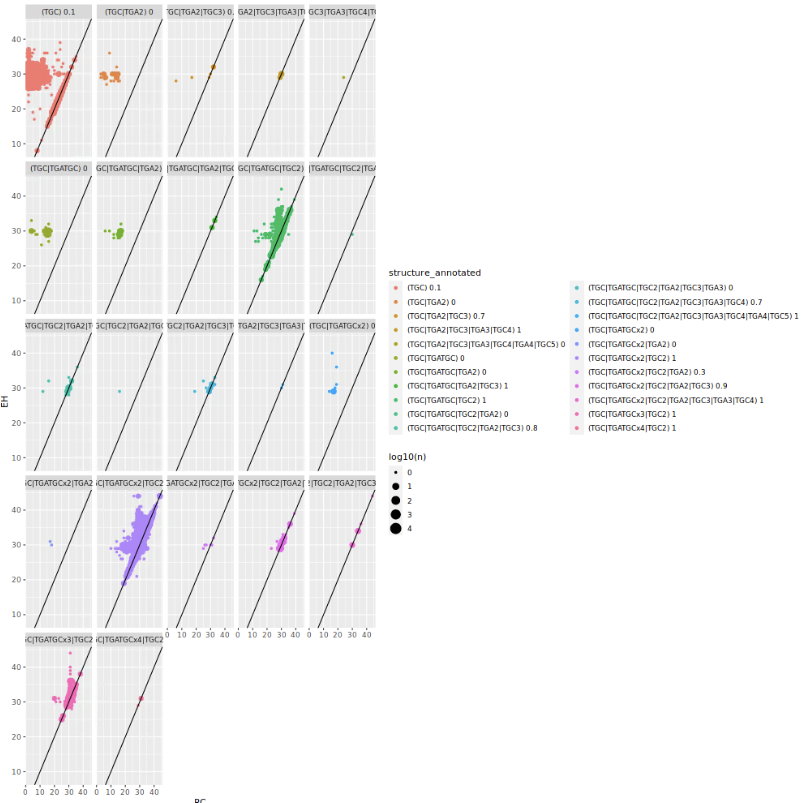
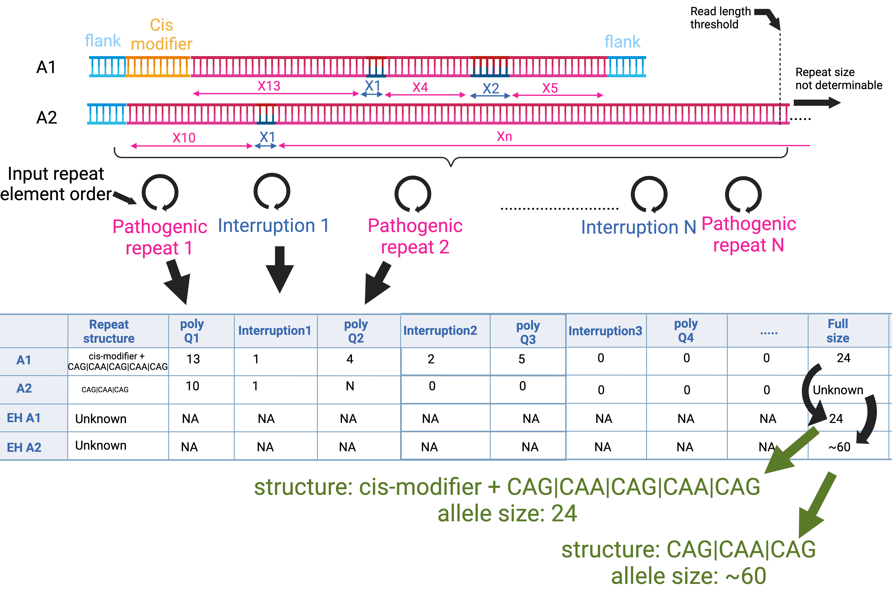

# Repeat Crawler
The variation in constitution and structure of repeat expansion loci (e.g. RFC1: AAAAG -> AAGGG. Or having intermittent CAA interruptions in a CAG track) is not readily accessible via classic bioinformatics tools like [ExpansionHunter](https://github.com/Illumina/ExpansionHunter) (EH). “Repeat Crawler” is a tool that supplements the output of EH by annotating the presence and length of elements that both interrupt and border the disease repeat within the recorded alleles.

## Context
Briefly, Expansion Hunter outputs a BAM file which contains the reads from a locus of interest. The reads are quality checked and annotated according to the sections of a repetitive region that each read covers. The various components of the repetitive region are marked by 0:flanking region, 1:first component and so on. Hence, this can be taken advantage when further analysing reads.

## Input and output
- Input:
    - JSON file with repeat component structures within the gene
    - File with absolute paths to the BAMlet files/single bamlet file
- Output:
    - TSV file, each row corresponds to a genome (e.g. BAMlet) and it records the number of reads including each repeat component described in the JSON file


Repeat Crawler accepts a list of repeat component structures (specified in a JSON input file) "crawls" along each read in an EH BAMlet file (small BAM) and documents the presence/absence and length of each component in the order that they are arranged in the input JSON file. NOTE the phrase "crawls" is used to convey that the program goes from each individual repeat component to the next as it makes it's way along a read.

Subsequently, it tallies the number of found structures across all reads and finds the 2 most common and reports them as the first and second alleles which were then assigned to the EH allele lengths (matched by adding the total length of the repeat components and comparing to the EH repeat sizes).

## Installation
The following versions have been used:

* python v3.7

# Local installation using .venv
1. Clone the repository
2. Go to gel folder
3. pip install -r requirements.txt
# Usage
To run Repeat Crawler on a list of EH BAMlet files:

Exemplary run of repeat crawler script on a list of Expansion hunter BAMlet files:

```
python RC_latest.py \
    --bam_files list_of_expansion_hunter_bamlets.txt \
    --output THAP11_RC.tsv \
    --gene THAP11 \
    --count CAG1 CAA1 CAG2 CAA2 CAG3 CAA3 CAG4 CAA4 CAG5 CAA5 CAG6 CAA6 CAG7 \
    --json THAP11_structure.json 
```
The above run is done on an exemplary list of EH output bamlet files (`cat list_of_expansion_hunter_bamlets.txt` to see the paths)- the reads are annotated according to the prespecified structure contained in `THAP11_structure.json`. 

# Specifying Structure
In order to study the reads, Repeat crawler will study reads according to what is inside the `--json structure.json` input file. The syntax required to design a structure is as follows:

```
{
"anchor_sequence":["(GGCAG){1,}"],
"CAG1":["(CAG){1,}"],
"CAA1":["(CAA){1,}"],
"CAG2":["(CAG){1,}"],
"CAA2":["(CAA){1,}"],
"CAG3":["(CAG){1,}"],
"CAA3":["(CAA){1,}"],
"CAG4":["(CAG){1,}"],
"CAA4":["(CAA){1,}"],
"CAG5":["(CAG){1,}"],
"CAA5":["(CAA){1,}"],
"CAG6":["(CAG){1,}"],
"CAA6":["(CAA){1,}"],
"CAG7":["(CAG){1,}"]
}
```
Each line in the list specifies a name for a repeat element `CAG1` and the regular expression needed to search for this element in a read e.g. `["(CAG){1,}"]`- to set a number of CAGs that need to be found e.g. 5 or more- you can change it to `["(CAG){5,}"]`. In the output this will be reported in a table as e.g. `CAG1=5|CAA1=1|CAG2=4....` . The repeat elements will only be reported in the order that that they are input.

# Test the input repeat structure
To see what annotation a bamlet is assigned- you can run RC as above only change the parameter `--bam_files ...` from plural to singular -> `--bam_file input.bam`. This will output a table as such:

```
CAG1  CAA1  CAG2 ....  nreads
5     1     4    ....  6
3     1     2    ....  3
1     2     1    ....  1
....
```
In the above table the allele structures are ranked by the number of reads supporting a given structure and the top two are taken as the alleles that will later be assigned to the EH repeat sizes.

# Assigning tructure to an EH repeat size
Having performed the initial annotation- one then needs to bind EH repeat sizes to the RC output and subsequently phase them. 
## Binding EH repeats
The binding of repeat sizes is initially done using `annotate_EH_lengths.py`- using the above exemplary output:

```
python annotate_EH_lengths.py --input THAP11_RC.tsv --gene THAP11 --motifs CAG --output THAP11_RC_eh.tsv
```

## Phasing of repeat structures when compared to EH repeat sizes

This step is done in R using the tools available in `phase_and_clean_and_plot_tools.R`:

```
R
source('phase_and_clean_and_plot_tools.R')
data=read.table('THAP11_RC_eh.tsv',sep='\t',header=T,stringsAsFactors=F)
data_phased$bam_file=basename(gsub('_THAP11.vcf','',data_phased$bam_file))
data=clean_data(data,4,c('first_second_gt','CAG1','CAA1','CAG2','CAA2','CAG3','CAA3','CAG4','CAA4','CAG5','CAA5','CAG6','CAA6','CAG7'))
data_phased=phase(data,list(c('CAG1','CAA1','CAG2','CAA2','CAG3','CAA3','CAG4','CAA4','CAG5','CAA5','CAG6','CAA6','CAG7')),c('EH_CAG'),multiples=NULL,'CAG')
```
Now you can start comparing the RC output to that of EH using the columns `CAG_sum_a1`,`CAG_sum_a2`,`EH_CAG_A1` and `EH_CAG_A2` to see how well RC annotated your EH data.
One way of doing this is to plot them against one another - using `plot_eh_vs_rc()`:
```
g=plot_eh_vs_rc(data_phased,c('CAG_sum_a1','CAG_sum_a2'),c('EH_CAG_A1','EH_CAG_A2'),c('GT1','GT2'))
```

The above plot is from a different analysis- but gives an example of how to compare EH vs RC output across repeat structure.
Each repeat structure in the legend has the percentage of alleles where EH and RC agree- allowing you to investigate repeat structures that are likely incorrect.

## Phasing in the case of repeats where the repeat can be expanded beyond 150 bp threshold
In some cases, it may be necessary to assign repeat structure without knowing the exact size of a repeat (when a repeat is expanded to a size that exceeds the 150bp limit of short read sequencing, EH estimates the size). To do this we employ a strategy that uses process of elimination to assign the found read structures to the 2 EH repeat alleles correctly.



Briefly, we assume that there will always be a shorter allele that is phaseable to allow us to assign a repeat structure to it and hence- by exclusion assign the remaining unassigned repeat structure to the expanded allele.

Here is a typical workflow for a repeat where alleles can expand beyond the 150bp (NOTE: this is not a known repeat expansion locus- rather an imaginary one- to provide example):

```
python RC_latest.py \
    --bam_files list_of_expansion_hunter_bamlets.txt \
    --output imaginary_gene_RC_0-2.tsv \
    --gene imaginary_gene \
    --span 0-2 \
    --count CAG1 CAA1 CAG2 CAA2 CAG3 CAA3 CAG4 CAA4 CAG5 CAA5 CAG6 CAA6 CAG7 \
    --json imaginary_gene.json

python annotate_EH_lengths.py --input imaginary_gene_RC.tsv --gene imaginary_gene --motifs CAG --output imaginary_gene_RC_0-2_eh.tsv

python RC_latest.py \
    --bam_files list_of_expansion_hunter_bamlets.txt \
    --output imaginary_gene_RC_0-1.tsv \
    --gene imaginary_gene \
    --span 0-1 \
    --count CAG1 CAA1 CAG2 CAA2 CAG3 CAA3 CAG4 CAA4 CAG5 CAA5 CAG6 CAA6 CAG7 \
    --json imaginary_gene.json 

R
source('phase_and_clean_and_plot_tools.R')
data=read.table('imaginary_gene_RC_0-2_eh.tsv',sep='\t',header=T,stringsAsFactors=F)
data_phased$bam_file=basename(gsub('_imaginary_gene.vcf','',data_phased$bam_file))
data=clean_data(data,4,c('first_second_gt','CAG1','CAA1','CAG2','CAA2','CAG3','CAA3','CAG4','CAA4','CAG5','CAA5','CAG6','CAA6','CAG7'))
data_phased=phase(data,list(c('CAG1','CAA1','CAG2','CAA2','CAG3','CAA3','CAG4','CAA4','CAG5','CAA5','CAG6','CAA6','CAG7')),c('EH_CAG'),multiples=NULL,'CAG')
data_0_1=read.table('imaginary_gene_RC_0-1.tsv',sep='\t',header=T,stringsAsFactors=F)
data_0_1=format_v0_data(data_0_1)
phased_data=merge_and_phase(data_phased,data_0_1,c('GT1','GT2','CAG_sum_a1','CAG_sum_a2','EH_CAG_A1','EH_CAG_A2'),'phased_new.txt')
```
